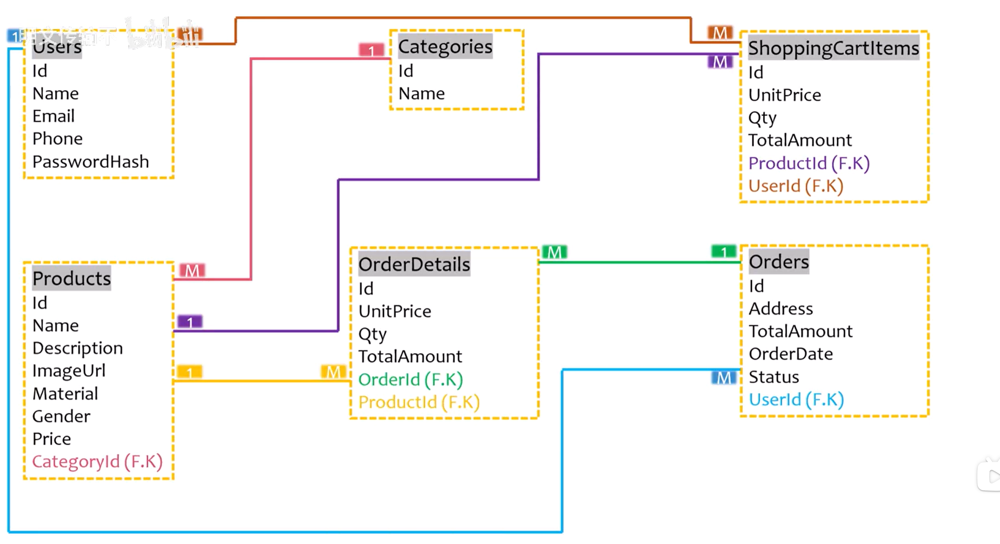
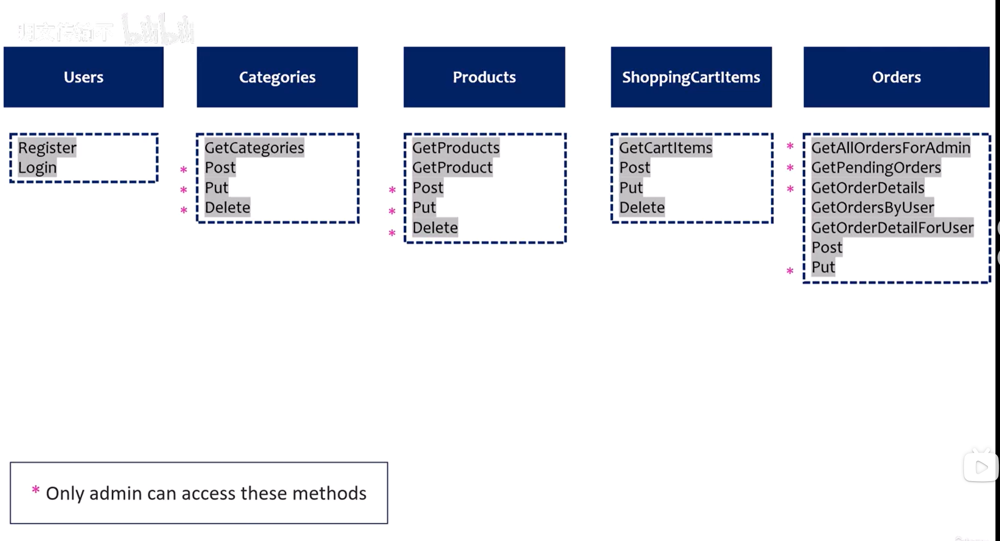
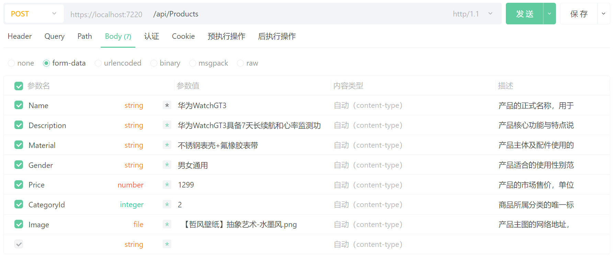

# WatchStoreApi
Api学习代码

视频地址：https://www.bilibili.com/video/BV16LS6BMEez/?spm_id_from=333.1007.top_right_bar_window_history.content.click&vd_source=165f75f03693604decd097540d6ef23b
资料地址：https://pan.quark.cn/s/fdbb6b464ea8


# 返回状态码

```c#
return BadRequest("Product is null");
return StatusCode(StatusCodes.Status201Created);
```

# 数据模型关系




# 规划Api路由于端点




# 在Api中支持文件上传

在上传数据的同时上传文件

```c#
public class Product
{
    public int Id { get; set; }
    public string Name { get; set; }
    public string Description { get; set; }
    public string ImageUrl { get; set; }
    public string Material { get; set; }
    public string Gender { get; set; }
    public decimal Price { get; set; }
    public int CategoryId { get; set; }
    /// <summary>
    /// 文件类型
    /// </summary>
    [NotMapped]
    [JsonIgnore]
    public IFormFile Image { get; set; }

}
```

控制器处理：

```c#
[HttpPost]
public async Task<IActionResult> Post([FromForm] Product product)
{
    if(product == null)
    {
        return BadRequest("Product is null");
    }
    var guid = Guid.NewGuid();
    var filePath = Path.Combine("wwwroot", guid + ".jpg");
    using (var stream = new FileStream(filePath, FileMode.Create))
    {
        await product.Image.CopyToAsync(stream);
    }
    // 将文件路径保存到数据库中，去掉 "wwwroot//" 前缀
    product.ImageUrl = filePath.Substring(8);
    await _dbContext.Products.AddAsync(product);
    await _dbContext.SaveChangesAsync();
    return StatusCode(StatusCodes.Status201Created);
}
```

在`Program.cs`中启用静态文件中间件，以允许访问文件

```c#
var app = builder.Build();

// Configure the HTTP request pipeline.

app.UseHttpsRedirection();

app.UseStaticFiles();

app.UseAuthorization();

app.MapControllers();

app.Run();
```

接口上传测试：



查询结果：

```json
[
	{
		"id": 1,
		"name": "华为WatchGT3",
		"description": "华为WatchGT3具备7天长续航和心率监测功能",
		"imageUrl": "68177755-fe67-428c-a783-7bb86c9b45b0.jpg",
		"material": "不锈钢表壳+氟橡胶表带",
		"gender": "男女通用",
		"price": 1299,
		"categoryId": 2
	}
]
```


可以直接通过`https://localhost:7220/68177755-fe67-428c-a783-7bb86c9b45b0.jpg`路径访问图片

# 搜索、筛选、分页查询

```c#
[HttpGet()]
public async Task<IActionResult> Get([FromQuery] string search, [FromQuery] int? CategoryId, [FromQuery] string material, [FromQuery] string gender, [FromQuery] decimal? minPrice, [FromQuery] decimal? maxPrice, [FromQuery] int pageNumber = 1, [FromQuery] int pageSize = 5)
{
    var query = _dbContext.Products.AsQueryable();
    if (string.IsNullOrWhiteSpace(search) == false)
    {
        query = query.Where(s => s.Name.ToLower().Contains(search.ToLower()) || s.Description.ToLower().Contains(search.ToLower()));
    }
    if (string.IsNullOrWhiteSpace(material) == false)
    {
        query = query.Where(s => s.Material.ToLower() == material.ToLower());
    }
    if (string.IsNullOrWhiteSpace(gender) == false)
    {
        query = query.Where(s => s.Gender.ToLower() == gender.ToLower());
    }
    if (minPrice.HasValue)
    {
        query = query.Where(s => s.Price >= minPrice.Value);
    }
    if (maxPrice.HasValue)
    {
        query = query.Where(s => s.Price <= maxPrice.Value);
    }
    if (CategoryId.HasValue)
    {
        query = query.Where(s => s.CategoryId == CategoryId.Value);
    }
    var products = await query.Skip((pageNumber - 1) * pageSize).Take(pageSize).ToListAsync();
    return products == null ? NotFound() : Ok(products);
}
```


# JWT认证

安装包：

```xml
<PackageReference Include="Microsoft.AspNetCore.Authentication.JwtBearer" Version="10.0.5" />
```

在`appsettings.json`中增加相关的JWT配置：

```json
{
  "Logging": {
    "LogLevel": {
      "Default": "Information",
      "Microsoft.AspNetCore": "Warning"
    }
  },
  "AllowedHosts": "*",
  "Jwt": {
    "Key": "saljfjalasdkjhsakjdhjkhksdfhksdhkfkhaksd",
    "Issuer": "https://localhost:7220",
    "Audience": "https://localhost:7220"
  }
}

```

在`Program.cs`中注册服务和启用中间件：

```c#
//添加JWT认证服务
// 1. 注册【认证服务】，指定默认使用 JWT Bearer 认证方案
builder.Services.AddAuthentication(JwtBearerDefaults.AuthenticationScheme)
        .AddJwtBearer(options =>  // 2. 配置 JWT Bearer 认证的具体参数
        {
            // 3. 核心：JWT 令牌验证规则（校验Token是否合法）
            options.TokenValidationParameters = new TokenValidationParameters
            {
                // ✅ 验证【签发者】（Issuer）：是否是我信任的服务器签发的Token
                ValidateIssuer = true,
                // ✅ 验证【接收者】（Audience）：是否是发给当前程序使用的Token
                ValidateAudience = true,
                // ✅ 验证【过期时间】：Token过期了直接拒绝访问
                ValidateLifetime = true,
                // ✅ 验证【签名密钥】：防止Token被篡改、伪造
                ValidateIssuerSigningKey = true,

                // 🔑 从配置文件读取：合法的【签发者】名称
                ValidIssuer = builder.Configuration["Jwt:Issuer"],
                // 🔑 从配置文件读取：合法的【接收者】名称
                ValidAudience = builder.Configuration["Jwt:Audience"],
                // 🔑 从配置文件读取密钥，生成【签名秘钥】（验签用，最核心）
                IssuerSigningKey = new SymmetricSecurityKey(Encoding.UTF8.GetBytes(builder.Configuration["Jwt:Key"]))
            };
        });
var app = builder.Build();
// Configure the HTTP request pipeline.
app.UseHttpsRedirection();
app.UseStaticFiles();
//添加认证中间件
app.UseAuthentication();
app.UseAuthorization();
app.MapControllers();
app.Run();
```

> 核心参数大白话解释
>
> | 参数                              | 作用（通俗版）                                     |
> | --------------------------------- | -------------------------------------------------- |
> | `ValidateIssuer = true`           | 只认**我自己服务器签发**的 Token，别人发的一律无效 |
> | `ValidateAudience = true`         | 只认**发给我这个程序**的 Token，防止 Token 被挪用  |
> | `ValidateLifetime = true`         | Token 过期自动失效，必须重新登录                   |
> | `ValidateIssuerSigningKey = true` | 校验 Token 签名，**防止被篡改 / 伪造**             |
> | `ValidIssuer`                     | Token 的**签发人**（你的项目名称 / 服务器标识）    |
> | `ValidAudience`                   | Token 的**接收人**（你的客户端 / 前端）            |
> | `IssuerSigningKey`                | **秘钥**，相当于 Token 的「防伪章」，只有我知道    |

生成Token：

```c#
public class LoginRequest
{
    public string Email { get; set; }
    public string Password { get; set; }
}
```

```c#
[HttpPost("[action]")]
public async Task<IActionResult> Login([FromBody] LoginRequest request)
{
    var currentUser = _dbContext.Users.FirstOrDefault(u => u.Email == request.Email);
    if (currentUser == null)
    {
        return NotFound("User not found");
    }

    var passwordHasher = new PasswordHasher<User>();
    var result = passwordHasher.VerifyHashedPassword(currentUser, currentUser.PasswordHash, request.Password);
    if (result != PasswordVerificationResult.Success)
    {
        return Unauthorized("Invalid password");
    }

    //生成JWT Token
    var securityKey = new SymmetricSecurityKey(Encoding.UTF8.GetBytes(_configuration["Jwt:Key"]));
    var credentials = new SigningCredentials(securityKey, SecurityAlgorithms.HmacSha256);

    //添加Claims
    var claims = new[]
    {
        new Claim(ClaimTypes.Email, request.Email)
    };
    var token = new JwtSecurityToken(issuer: _configuration["Jwt:Issuer"],
        audience: _configuration["Jwt:Audience"],
        claims: claims,
        expires: DateTime.Now.AddHours(1),
        signingCredentials: credentials);
    return new ObjectResult(new
    {
        access_token = new JwtSecurityTokenHandler().WriteToken(token),
        token_type = "Bearer",
        user_id = currentUser.Id,
        user_name = currentUser.Name,
    });
}
```

使用认证保护Api接口：

在需要保护的Api控制器或端点(方法)上添加`[Authorize]`特性即可


# 授权

在生成Token中增加角色的Claim：

```c#
//添加Claims
var claims = new[]
{
    new Claim(ClaimTypes.Email, request.Email),
    new Claim(ClaimTypes.Role, currentUser.Role)
};
```

在需要授权的控制器或端点上增加特性：

```c#
//只有经过认证且角色为Admin的用户才能访问
[Authorize(Roles = "Admin")]
public async Task<IActionResult> Delete(int id)
{
    var existingCategory = await _dbContext.Categories.FindAsync(id);
    if (existingCategory == null)
    {
        return NotFound();
    }
    _dbContext.Categories.Remove(existingCategory);
    await _dbContext.SaveChangesAsync();
    return Ok("Category deleted successfully.");
}
```


# 接口调试

项目开发时使用ApiPost作为接口调试工具，版本为8.2.6

在doc文件夹中已经导出接口项目文件，提供`swagger`和`apipost`2种格式的导出文件，导入对应的接口调试工具中即可使用：

- swagger：WatchStoreApi.openapi.3.0.json
- apipost：WatchStoreApi.json


